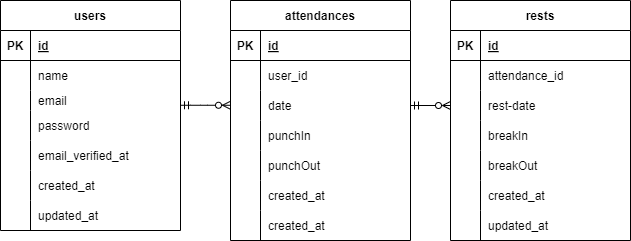

# Atte(勤怠管理アプリ)

## 環境構築
**Dockerビルド**
1. `git clone git@github.com:eto0831/attendance-2.git`
2. DockerDesktopアプリを立ち上げる
3. `docker-compose up -d --build`

**Laravel環境構築**
1. `docker-compose exec php bash`
2. `composer install`
3. 「.env.example」ファイルを 「.env」ファイルに命名を変更。または新しく「.env」ファイルを作成
4. .envに以下の環境変数を追加
``` text
APP_NAME=Atte

DB_CONNECTION=mysql
DB_HOST=mysql
DB_PORT=3306
DB_DATABASE=laravel_db
DB_USERNAME=laravel_user
DB_PASSWORD=laravel_pass

PMA_ARBITRARY=1
PMA_HOST=mysql
PMA_USER=laravel_user
PMA_PASSWORD=laravel_pass

MAIL_MAILER=smtp
MAIL_HOST=mailhog
MAIL_PORT=1025
MAIL_USERNAME=null
MAIL_PASSWORD=null
MAIL_ENCRYPTION=null
MAIL_FROM_ADDRESS=test@example.com
MAIL_FROM_NAME="${APP_NAME}"
```
5. アプリケーションキーの作成
``` bash
php artisan key:generate
```

6. マイグレーションの実行
``` bash
php artisan migrate
```

7. シーディングの実行
``` bash
php artisan db:seed
```

## 使用技術(実行環境)
- PHP8.3.0
- LAravel8.83.27
- MYSQL8.0.26

## ER図


## URL
- 開発環境：http://localhost/
- phpMyAdmin：http://localhost:8080/
- MailHog：http://localhost:8025/
- 本番環境：http://35.77.94.54/
- 本番環境 phpMyAdmin：http://35.77.94.54:8080/
- 本番環境 MailHog：http://35.77.94.54:8025/
